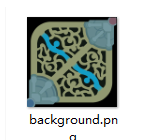
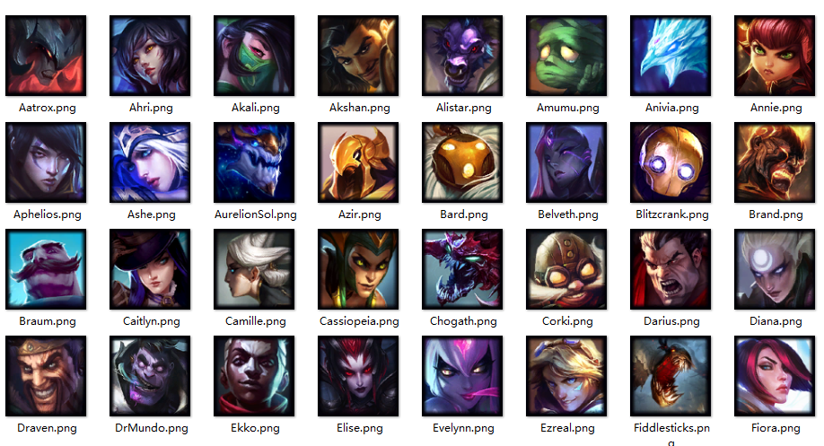
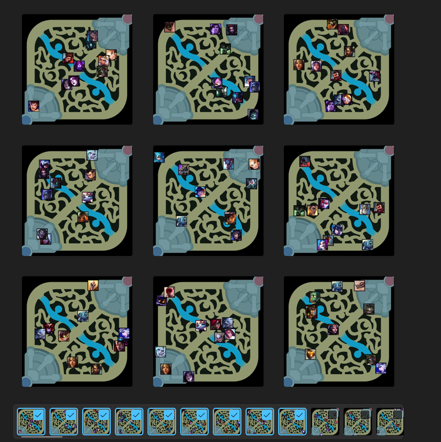

# 使用说明

## background文件夹存放背景图片




## object文件夹存放实体物品图片



## DataOut文件夹为生成的图像数据



### data.json保存实物图名称以及坐标数据

```json
{
    "image": "image_0.jpg",
    "candidates": [
        {
            "name": "Kaisa.png",
            "x": 354,
            "y": 587
        },
        {
            "name": "Renata.png",
            "x": 674,
            "y": 470
        },
        {
            "name": "MonkeyKing.png",
            "x": 366,
            "y": 349
        },
        {
            "name": "Malzahar.png",
            "x": 467,
            "y": 422
        },
        {
            "name": "Karthus.png",
            "x": 572,
            "y": 214
        },
        {
            "name": "Udyr.png",
            "x": 585,
            "y": 150
        },
        {
            "name": "Morgana.png",
            "x": 419,
            "y": 556
        },
        {
            "name": "Garen.png",
            "x": 56,
            "y": 783
        },
        {
            "name": "Lux.png",
            "x": 756,
            "y": 321
        },
        {
            "name": "Qiyana.png",
            "x": 688,
            "y": 373
        }
    ]
}
```

